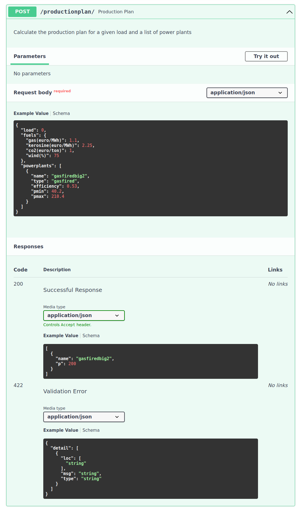
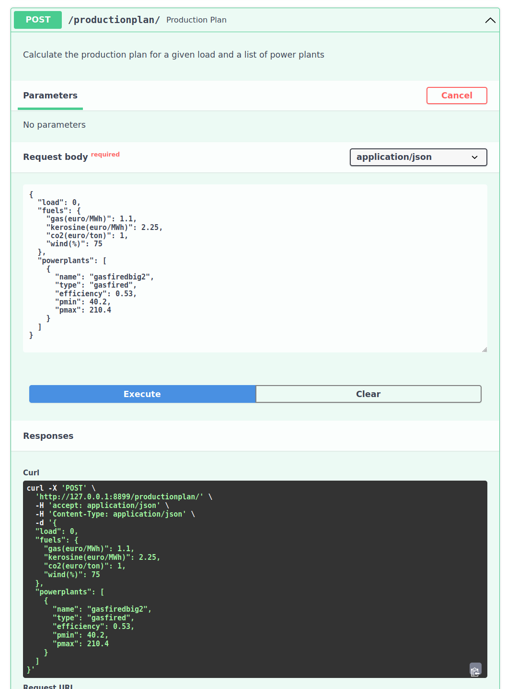

# powerplant-coding-challenge


## 🏢 Description
Calculate how much power each of a multitude of different powerplants need to produce (a.k.a. the production-plan) 
when the load is given and taking into account the cost of the underlying energy sources (gas, kerosine) and the 
Pmin and Pmax of each powerplant.
* Do not to rely on an existing (linear-programming) solver.
* The focus is on the programming concepts and structures and will be used as a base to discuss all kinds of 
interesting software engineering topics.
You can read the [full coding-challenge assignment](assets/coding-challenge.md) for more details.

## 📦 Repo structure
```
.
├── app
│   ├── __init__.py
│   ├── main.py
│   ├── models
│   │   ├── meritorder.py
│   │   └── powerplants.py
│   ├── schemas
│   │   ├── fuels.py
│   │   └── powerplant.py
│   ├── tests
│   │   ├── conftest.py
│   │   └── test_main.py
│   └── utils.py
├── docker-compose.yml
├── Dockerfile
├── example_payloads
│   ├── payload1.json
│   ├── payload2.json
│   └── payload3.json
├── README.md
├── requirements.txt
```

## 🚀 To start the server with docker
```bash
sudo docker compose up -d --build

# or for the older docker versions:
sudo docker-compose up -d --build
```
Open [http://localhost:8899/docs](http://localhost:8899/docs) 
or [http://127.0.0.1:8899/docs](http://127.0.0.1:8899/docs) in your browser.
### To stop
```bash
sudo sudo docker compose dwon -v

# or for the older docker versions:
sudo sudo docker-compose dwon -v
```
## Screenshot
### Automatic Generated API Documentation
Fast API generates an automatic generated API documentation.

### Interactie API Documentation
The automatic generated API documentations are also interactive and you can test out the API just in the browser.

## ⏱️ Timeline
This project took a study day and an execution day and was build in the pre copilot and chatGPT era.

## 📌 Personal Situation
This project was done as part of job interview. It was the first time that I used FastApi and the first time I 
started out a project with Test Driven Development approach. I had lots of fun exploring these new concepts.

### Connect with me!
[](https://www.linkedin.com/in/gerrit-geeraerts-143488141)
[](https://stackoverflow.com/users/10213635/gerrit-geeraerts)
